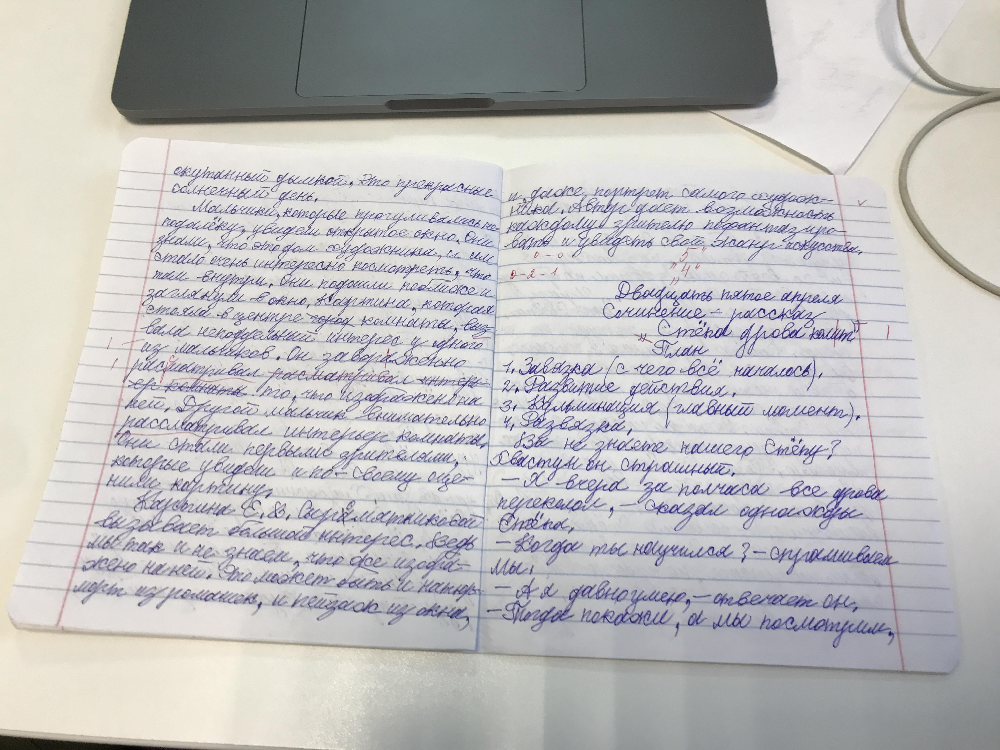

# Обзор проводимых экспериментов 

Глобально наш проект представляет из себя два блока - один блок ответственен за распознавание рукописного текста (OCR - Handwritten text recognition) Второй же блок несет отвественность за обработку этого оцифрованного текста (на данный момент это спеллчекеры). 

Упрощено мы назвали это CV для задачи распознавания текста, и NLP для задачи его обработки. 

Результат работы должен выглядеть следующим образом - Андрей выбирает модель nlp, я выбираю модель cv, и дальше мы соединяем модели по следующему принципу - вначале входящее изображение передается в модель распозавания рукописного текста а после в модель Андрея. 

# Обзор подходов к решению задачи 

На данный момент существует 3 основных пути решения задачи оцифровки рукописного текста - 
1) Использовать готовое решение, предоставляемое по коммерческой модели, модель подразумевается как сервис а не как объект владения. В данном случае мы имеем только доступ к предсказаниям модели (в случае обращения по модели через API)
2) Использовать готовую архитектуру нейронных сетей/прочих алгоритмов машинного обучения(для упрощения назовем просто "самописные модели"), архитектура должна быть открытой, подразумевается дополнительное дообучение модели и "тюнинг" - то есть настройка параметров модели 
3) Использование коммерческой модели по принципу владения, и как следствие имеем возможность размещения на собственном сервере, что является довольно важным условием для работы с чувствительной информацией (личные данные пользователя)

#  Проблема данных

Есть на данный момент довольно большая проблема в размеченном датасете - нормального размеченного "чистого" датасета нет, по плану его необходимо получить либо через тотальный диктант, либо через заказ разметки в яндекс заданиях. На данном этапе поьзовались "грязным" датасетом рукописных тетрадок (https://huggingface.co/datasets/ai-forever/school_notebooks_RU), создали свой микро датасет чистого рукописного текста(папка images) а для модели CRNN использовали размеченный сет по словам, а не полноценным текстам (потому что модель обучается на таких данных, в отличии от коммерческих)

Есть в этом конечно большая проблема, что приходится по крупицам собирать данные и каждую модель на своем проверять, но рабоатем с тем, что имеем - на самом деле это дает нормальное понимание о перформансе моделей. 

# Плюсы и Минусы каждого подхода

Краткий обзор преимуществ и недостатков каждого варианта 

## Готовое решение по API 

Плюсы -

1) Простой вызов

2) не требует настройки и заморочек

3) готовое решение

Минусы - 

1) Размещение модели на сервере поставщика услуги (Яндекс)

2) Невозможность влияния на модель 

3) Непонимание устройства модели 

## Самопис 

Плюсы - 

1) Знаем все про модель 

2) Можно улучшить почти всегда 

3) Локальное размещение 

Минусы - 

1) Низкое качество первые n версий модели

2) Нужно много ресурса, чтобы достичь качества, соизмеримого с коммерческими моделями 

3) Скорее всего является плохой репликой уже обученной модели 

## Коммерческая модель, у которой мы имеем "слепок" размещенный локально 

1) Понимание устройства модели 

2) Возможность модификаций 

3) Данные не утекают на сторону 

Минусы - 

1) Долгие по времени переговоры и постановка задачи с условиями 

2) Самый дорогой вариант 

# Что рассматривали? 

Взяли для сравнения несколько моделей - 

1) Yandex vision OCR - коммерческая модель, доступ по API 

2) Архитектура CRNN - "самопис"

3) Tesseract - старая модель изначально использовавашаяся для распознавания печатного текста, для референса

4) content.ai (модель распознавания рукописного текста) - Коммерческая с возможностью размещения у себя

# Оценка качества моделей

Поскольку мы НЕ делаем никакой автокоррекции и тд, нас интересует именно посимвольное качество, также для CRNN посчитал отдельно по словам, тк там слово=весь текст.

в таблице много пропусков, поскольку проверяли на разных данных. 

Общая сводная таблица - 

| Модель / показатель | Чистый - по буквам | Чистый - по словам | Грязный - по буквам(ru) | Грязный - по словам(ru) |
|---------------------|--------------------|--------------------|-------------------------|-------------------------|
| Yandex vision OCR   | 90%                | Другой сет         | Другой сет              | 65%                     |
| CRNN                | 84%                | 70%                | обучен под en           | обучен под en           |
| content.ai          | Ожидаем            | Ожидаем            | Ожидаем                 | Ожидаем                 |
| Tesseract           | 0                  | -                  | 0                       | -                       |

также дополнительная информация - 

Подробные результаты на чистом сете - Яндекс - 

| Пример из чистого сета  | Yandex vision OCR - по буквам |
|-------------------------|-------------------------------|
| img1                    | 0.9245283018867925            |
| img2                    | 0.9024390243902439            |
| img3                    | 0.8522727272727273            |
| img4                    | 0.9375                        |
| img5                    | 0.9411764705882353            |
| img6                    | 0.9690721649484536            |
| img7                    | 0.943089430894309             |
| img8                    | 0.8865248226950355            |
| img9                    | 0.8321167883211679            |
| img10                   | 0.7833333333333333            |

Результаты на грязном сете Яндекс - 
| Значения для грязного сета - Yandex  | число              |
|--------------------------------------|--------------------|
| Мат ожидание                         | 0.6415852550670028 |
| мода                                 | 0.6                |
| Медиана                              | 0.6493081448338719 |

(Указаны средние значения так как грязный датасет большой)

3) CRNN показал качество 84% на определении букв и 70% на определении слов(учитываются только полностью определенные слова)

4) в content.ai передали "грязный" и "чистый" датасет, ждем скоров

P.S.Код лежит в гите, но там легкий ад в зависимостях, все скрипты требуют разных версий либ, так что необходимо собрать несколько версий requirements.txt -
Сейчас самый удобный вариант следующий - 

1) для модели Yandex написан набор методов, [utils.py](utils.py), вызов методов проихсодит через скрипт [yandex_ocr_main.py](yandex_ocr_main.py), там есть булевые флаги, один - на отправление списка картинок в API, другой направленный на подсчет метрики по полученному тексту. 

2) Для модели CRNN рекомендую воспользвоаться готовым ноутбуком на Kaggle (это изначально открытая архитектура для переиспользования), и тогда не будет проблемы с вычислительными мощностями и настройкой окружения (изза использования специфических либ я так и не смог подобрать их правильные версии, и в итоге воспользоваться предварительно настроенным кружением kaggle - можно также заменить kaggle на Colab) - https://www.kaggle.com/code/ilyakasimovdsba/crnn-train, обучение происходит на латиннице, поскольку размеченного датасета кириллицы такого не было под рукой. Это не критично, потому что архитектура не зависит от языка, достаточно большой датасет латиницы дает понимание о том, какое качество может быть достигнуто на кириллице.
Мjжно локально через [CRNN_Model.ipynb](CRNN_Model.ipynb)

3) Tesseract можно вызвать как из питона, так и воспользоваться внешними сервисами, смысла в этом особого нет, качество тессеракта без переобучения нулевое. 

# Работа над качество изображений - через дефолтные методы OpenCV

Для данного процесса взял либу OpenCV и вытащил из нее варианты предобработки, которые стандартно применяют в задачах OCR. Помимо этого в следующей главе будет работа с моделями, убирающими шум (а не просто фильтры на изображения)

полный список методов (код лежит здесь - [preprocessing.py](preprocessing.py)):

1) remove_noise

2) erosion

3) dilation

4) get_grayscale

5) gauss

6) median

7) biliteral

Последовательно воспользуемся каждым преобразованием и посмотрим, как оно меняет изображение, для теста взяли следующее изображение - 

## Denoiser 

Просвечивающиеся буквы стали менее заметны - до применения  и после примененеия 

## Erosion 

Текст стал жирнее 

До - 

После - 

## Dilation

Текст стал нечитаем (слишком тонкие линии)

До - 

После - 

## Grayscale

Перевод в чб 

До -  

После - 

## Gauss

Изменения не увидел 

## Median

Также особо не замечено изменение 

## Bilateral 

## Hist Eq

До -  

После - 

минимальное изменение, как при Гауссе

# Скоры на грязном сете Яндекс с применением фильтров 

## Denoiser

| Значения для грязного сета - Yandex  | число              |
|--------------------------------------|--------------------|
| Мат ожидание                         | 0.6375830441279922 |
| мода                                 | 0.6666666666666666 |
| Медиана                              | 0.6510869565217392 |

## Erosion

| Значения для грязного сета - Yandex  | число              |
|--------------------------------------|--------------------|
| Мат ожидание                         | 0.5745640190511343 |
| мода                                 | 0.6363636363636364 |
| Медиана                              | 0.5982114964073727 |

## Grayscale

| Значения для грязного сета - Yandex  | число              |
|--------------------------------------|--------------------|
| Мат ожидание                         | 0.6419593100074589 |
| мода                                 | 0.5                |
| Медиана                              | 0.6580062649714391 |

## Hist Eq CLAHE 

| Значения для грязного сета - Yandex  | число              |
|--------------------------------------|--------------------|
| Мат ожидание                         | 0.6381438445179333 |
| мода                                 | 0.5                |
| Медиана                              | 0.6553000609702988 |

# Результаты content.ai 

Направили в content.ai  20 грязных изображений, получили следующий скор (учитываются только полностью совпавшие слова):

| Значения для грязного сета - Content.ai | число              |
|-----------------------------------------|--------------------|
| Мат ожидание                            | 0.6968781658505563 |
| мода                                    | 0.4765100671140939 |
| Медиана                                 | 0.6918604651162791 |

И на таком же сете яндекс - 

| Значения для грязного сета - Yandex vision OCR | число              |
|------------------------------------------------|--------------------|
| Мат ожидание                                   | 0.647191061938061  |
| мода                                           | 0.5                |
| Медиана                                        | 0.6615336018321093 |

Подробные результаты на чистом сете - Яндекс - 

| Пример из чистого сета  | Yandex vision OCR - по буквам |
|-------------------------|-------------------------------|
| img1                    | 0.9245283018867925            |
| img2                    | 0.9024390243902439            |
| img3                    | 0.8522727272727273            |
| img4                    | 0.9375                        |
| img5                    | 0.9411764705882353            |
| img6                    | 0.9690721649484536            |
| img7                    | 0.943089430894309             |
| img8                    | 0.8865248226950355            |
| img9                    | 0.8321167883211679            |
| img10                   | 0.7833333333333333            |

Подробные результаты на чистом сете - Content.ai - 

| Пример из чистого сета  | content.ai - по буквам        |
|-------------------------|-------------------------------|
| img1                    | 0.9811320754716981            |
| img2                    | 0.991869918699187             |
| img3                    | 0.875                         |
| img4                    | 0.9874213836477987            |
| img5                    | 0.8296296296296296            |
| img6                    | 0.8854166666666666            |
| img7                    | 0.4444444444444444            |
| img8                    | 0.9507042253521126            |
| img9                    | 0.5474452554744526            |
| img10                   | 0.9583333333333334            |

# Убираем линии

Довольно хорошо убирает линии, но результат не стал лучше. Пример работы - 

Изначальное изображение - 

После обработки - 

## Сухие цифры

| Значения для грязного сета - Yandex  | число              |
|--------------------------------------|--------------------|
| Мат ожидание                         | 0.5661496724202515 |
| мода                                 | 0.2953020134228188 |
| Медиана                              | 0.533678756476684  |

# Убираем все, кроме текста (уборка шума)

Частично работает хорошо - частично ужасно 

Приведем примеры плохого и хорошего результата

## Хороший результат 

Изначальное изображение - 

После обработки - 

## Плохой результат

Изначальное изображение - 

После обработки - 

## Сухие цифры

| Значения для грязного сета - Yandex  | число              |
|--------------------------------------|--------------------|
| Мат ожидание                         | 0.3401775586175377 |
| мода                                 | 0.01342281879194630|
| Медиана                              | 0.2603550295857988 |